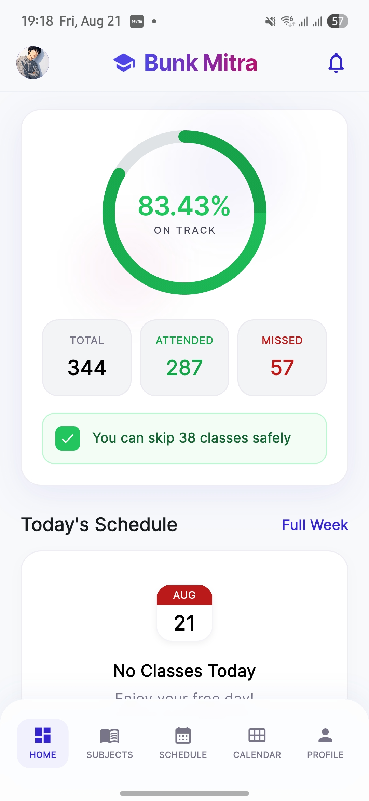
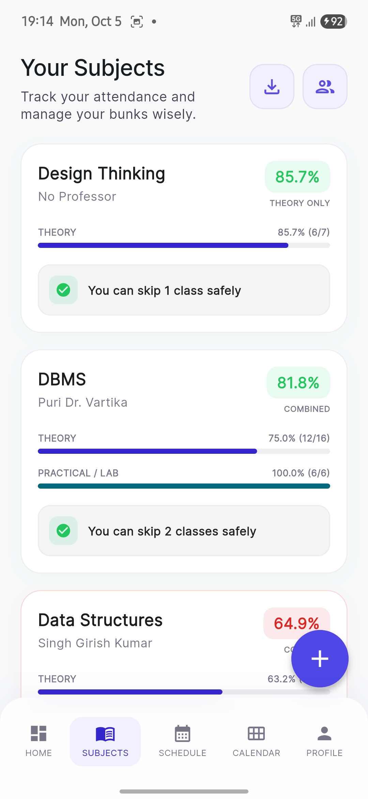
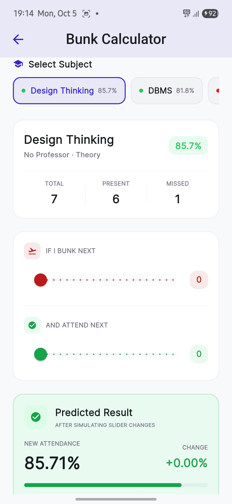
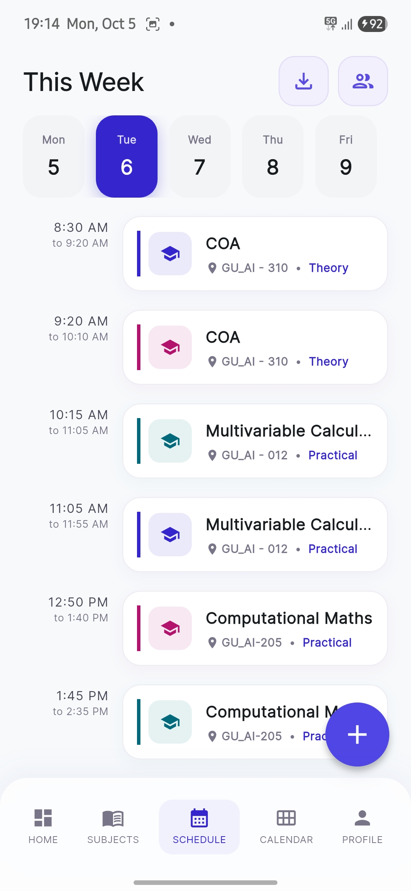
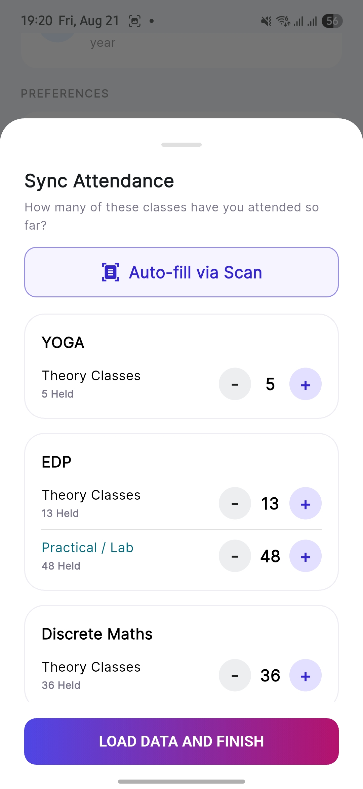

<div align="center">

# 🎓 Bunk Mitra
### *Your Smart Attendance Assistant & Bunk Calculator*

[-FF6F00?style=for-the-badge&logo=android&logoColor=white)](https://github.com/imscaryclown/bunk-mitra/releases/latest)
[](https://flutter.dev)
[](https://dart.dev)
[](https://supabase.com)
[](https://aistudio.google.com)
[](https://shorebird.dev)
[](LICENSE)

<br />

<p align="center">
  <b>Never accidentally fall below 75% attendance again.</b><br>
  Bunk Mitra simplifies student life by calculating safe bunks, managing weekly schedules, sending post-class check-in prompts, and leveraging Gemini AI to parse timetables directly from images.
</p>

[Download APK](#-option-1-direct-download-recommended-for-users) •
[Screenshots](#-app-previews) •
[Key Features](#-key-features) •
[Tech Stack](#-tech-stack) •
[Architecture](#-project-architecture) •
[Getting Started](#-getting-started) •
[Team](#-meet-the-team)

---

</div>

## 📱 App Previews

<div align="center">
<table>
  <tr>
    <td align="center" width="20%">
      <b>📊 Dashboard</b><br />
      <sub>Live stats & safe bunks</sub><br /><br />
      
    </td>
    <td align="center" width="20%">
      <b>📚 Subjects</b><br />
      <sub>Theory & lab breakdown</sub><br /><br />
      
    </td>
    <td align="center" width="20%">
      <b>🧮 Calculator</b><br />
      <sub>What-if simulator</sub><br /><br />
      
    </td>
    <td align="center" width="20%">
      <b>📅 Schedule</b><br />
      <sub>Weekly timetable & slots</sub><br /><br />
      
    </td>
    <td align="center" width="20%">
      <b>🤖 AI Parser</b><br />
      <sub>OCR attendance sync</sub><br /><br />
      
    </td>
  </tr>
</table>
</div>

---

## 💡 Why Bunk Mitra?

Every college student knows the daily dilemma:
> *"Kitne classes bunk kar sakte hain?"*  
> *"Will my attendance drop below 75% if I miss today's 9 AM lecture?"*

Miscalculations lead to attendance shortages, debarment, and unnecessary exam stress. **Bunk Mitra** gives students complete control with real-time tracking, intelligent bunk calculations, and automatic timetable extraction.

---

## ✨ Key Features

### 📊 1. Real-Time Attendance Dashboard
- **Overall Attendance Ring:** Interactive animated progress circle showing live percentage.
- **Safe Bunks Counter:** Instantly know how many classes you can afford to skip without dropping below your target (75%, 80%, 85%).
- **Subject-Wise Cards:** Separate theory & practical counts with dedicated status indicators.

### 🧮 2. Smart Bunk Calculator (What-If Simulator)
- **Safe Skip Estimator:** Calculates the exact number of consecutive lectures you can safely skip.
- **Catch-Up Planner:** Tells you exactly how many upcoming classes you must attend to recover from a shortage.
- **Custom Targets:** Adapt calculations to your university's attendance threshold.

### 🤖 3. AI Timetable & Attendance OCR (Gemini 2.5 Flash)
- **Image-to-Timetable:** Snap a photo or upload a screenshot of your college timetable; Gemini AI extracts subject names, room numbers, professors, and time slots.
- **Attendance Sheet Parser:** Parse attendance numbers directly from university ERP screenshots.

### 🔔 4. Interactive Post-Lecture Prompts & Personas
- **Automatic Check-In Reminders:** Triggers notification prompts right after class slots finish so you can mark `Present`, `Absent`, or `Cancelled` in one tap.
- **Notification Personas:** Choose custom reminder attitudes (e.g. *Strict Professor*, *Chill Buddy*, *Sarcastic Bunker*).

### 📅 5. Weekly Schedule & Timetable Sharing
- **Slot Management:** Day-by-day timetable view with subject, time, and room tagging.
- **Share Code Generator:** Share your complete semester timetable with batchmates using a simple 6-character code.

### ☁️ 6. Cloud Sync & Offline-First Architecture
- **Supabase Cloud Sync:** Real-time database sync across devices.
- **Offline Cache:** Seamless offline functionality using local storage; syncs changes automatically when reconnected.

### ⚡ 7. Shorebird CodePush (OTA Updates)
- Instant hot-patches and updates delivered over-the-air without waiting for app store reviews.

---

## 🛠 Tech Stack

| Domain | Technology / Library |
|---|---|
| **Framework** | [Flutter](https://flutter.dev) (v3.x) & [Dart](https://dart.dev) (v3.x) |
| **State Management** | [Flutter Riverpod](https://pub.dev/packages/flutter_riverpod) (v2.5+) |
| **Routing** | [GoRouter](https://pub.dev/packages/go_router) (v14.2+) |
| **Backend & Auth** | [Supabase](https://supabase.com) (PostgreSQL, Realtime, Auth, Storage) |
| **Artificial Intelligence** | [Google Generative AI SDK](https://pub.dev/packages/google_generative_ai) (`gemini-2.5-flash`) |
| **OTA CodePush** | [Shorebird](https://shorebird.dev) |
| **Local Storage** | [SharedPreferences](https://pub.dev/packages/shared_preferences) |
| **Notifications** | [Flutter Local Notifications](https://pub.dev/packages/flutter_local_notifications) & [Timezone](https://pub.dev/packages/timezone) |
| **UI & Animations** | [Flutter Animate](https://pub.dev/packages/flutter_animate), [Google Fonts (Inter)](https://pub.dev/packages/google_fonts), [CachedNetworkImage](https://pub.dev/packages/cached_network_image) |

---

## 📂 Project Architecture

Bunk Mitra follows a modular, **feature-first clean architecture**:

```text
lib/
├── core/                        # Global configs, theme, constants & local storage
│   ├── constants/               # App colors, styles, and assets
│   ├── database/                # Local storage services & caching
│   ├── theme/                   # Light & Dark theme definitions
│   └── utils/                   # Math helpers, date formatters, validators
├── features/                    # Feature modules (UI, controllers & state)
│   ├── auth/                    # Login, Signup, Reset Password
│   ├── calculator/              # Bunk calculator & what-if simulator
│   ├── dashboard/               # Main attendance overview & summary ring
│   ├── history/                 # Attendance logs & retroactive edits
│   ├── notifications/           # Notification services, personas & schedulers
│   ├── profile/                 # Profile management, settings, theme switcher
│   ├── schedule/                # Timetable slots, day-view & schedule sharing
│   └── subjects/                # Add/edit subjects, practicals, attendance counts
├── models/                      # Dart data models & serialization
├── screens/                     # Main shell layout & navigation bar
├── services/                    # Supabase backend & Gemini AI integrations
└── widgets/                     # Reusable UI components & custom cards
```

---

## 🚀 Getting Started

### 📱 Option 1: Direct Download (Recommended for Users)

If you simply want to install and use Bunk Mitra on your Android device:

1. Go to the **[Latest GitHub Releases](https://github.com/imscaryclown/bunk-mitra/releases/latest)** page.
2. Download the latest `bunk-mitra.apk`.
3. Tap on the downloaded file on your Android device to install. *(If prompted, allow "Install from unknown sources" in settings)*.
4. Open the app, set up your schedule or snap a picture with AI, and you're good to go! 🎉

---

### 💻 Option 2: Build & Run from Source (For Developers)

If you want to contribute, modify code, or run locally on an emulator:

#### 📋 Prerequisites
- [Flutter SDK](https://docs.flutter.dev/get-started/install) (3.12+ recommended)
- [Dart SDK](https://dart.dev/get-dart)
- Android Studio / VS Code with Flutter extensions
- Android/iOS Device or Emulator

#### 📥 1. Clone the Repository
```bash
git clone https://github.com/imscaryclown/bunk-mitra.git
cd bunk-mitra
```

#### 📦 2. Install Dependencies
```bash
flutter pub get
```

#### 🔑 3. Configure Environment Variables
Create a `.env` file in the project root:

```bash
cp .env.example .env
```

Add your Google Gemini API Key:
```env
GEMINI_API_KEY=your_actual_gemini_api_key_here
```
> [!NOTE]
> You can generate a free Gemini API key from [Google AI Studio](https://aistudio.google.com/).

#### ▶️ 4. Run the Application
```bash
# Run in debug mode on connected device/emulator
flutter run
```

---

## 👥 Meet the Team

Bunk Mitra was conceptualized and built with ❤️ by students from **Galgotias University**:

<div align="center">
<table>
  <tr>
    <td align="center" width="33%">
      <br />
      <sub><b>Md Alfaaz</b></sub><br />
      <sub>Lead Developer</sub><br />
      <a href="https://github.com/imscaryclown">💻 GitHub</a> •
      <a href="https://www.linkedin.com/in/md-alfaaz-4b13b314b">🔗 LinkedIn</a> •
      <a href="https://instagram.com/mdalfaaz">📷 Instagram</a>
    </td>
    <td align="center" width="33%">
      <br />
      <sub><b>Utkarsh Singh</b></sub><br />
      <sub>Collaborator & Designer</sub><br />
      <a href="https://www.linkedin.com/in/utkarsh-singh-2b0279387">🔗 LinkedIn</a> •
      <a href="https://instagram.com/utkarshsingh.47">📷 Instagram</a>
    </td>
    <td align="center" width="33%">
      <br />
      <sub><b>Amit Yadav</b></sub><br />
      <sub>QA & Testing</sub><br />
      <sub>Galgotias University</sub>
    </td>
  </tr>
</table>
</div>

---

## 🤝 Contributing

Contributions, issues, and feature suggestions are welcome!

1. Fork the Project
2. Create your Feature Branch (`git checkout -b feature/AmazingFeature`)
3. Commit your Changes (`git commit -m 'feat: Add some AmazingFeature'`)
4. Push to the Branch (`git push origin feature/AmazingFeature`)
5. Open a Pull Request

---

## 📄 License

This project is distributed under the **MIT License**. See the [LICENSE](LICENSE) file for more information.

<div align="center">
  <sub>Made with ❤️ for students everywhere</sub>
</div>
